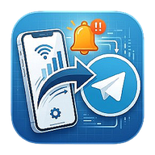

  

# NextNotify

NextNotify is a smart Android notification forwarding application that allows users to monitor important device activities in real time through Telegram.

The application can securely access Android system notifications, SMS messages, and phone call events, then automatically forward selected information to a Telegram bot or chat.

---

## ✨ Features

- 📲 Real-time Android notification monitoring
- 💬 SMS message forwarding
- 📞 Incoming & missed call detection
- 🚀 Instant Telegram delivery
- 🔔 App notification filtering
- ⚡ Lightweight foreground background service
- 🔒 Secure and user-controlled forwarding
- 🔋 Optimized for modern Android devices

---

## 📦 Supported Data

NextNotify can forward:

- Android system notifications
- SMS messages
- Incoming calls
- Missed calls
- Device alerts from selected applications

---

## ⚙️ Requirements

- Android 8.0+
- Notification Access permission
- SMS permission
- Phone State permission
- Internet connection

---

## 🔐 Permissions

The application requires the following permissions to operate correctly:

| Permission | Purpose |
|------------|---------|
| Notification Access | Read system notifications |
| READ_SMS | Access incoming SMS messages |
| READ_PHONE_STATE | Detect incoming/missed calls |
| FOREGROUND_SERVICE | Keep background forwarding active |
| INTERNET | Send data to Telegram |

---

## 📡 Telegram Integration

NextNotify uses Telegram Bot API to deliver messages instantly.

Users can:
- Connect their own Telegram bot
- Configure chat IDs
- Customize forwarded content
- Filter apps and notification types

---

## 🛡️ Privacy

Your data remains fully under your control.

NextNotify only sends information to the Telegram destination configured by the user. No data is stored on external servers.

---

## 🚀 Use Cases

- Remote device monitoring
- Notification synchronization
- Personal alert backup
- Business monitoring
- Multi-device management
- Remote SMS access

---

## 📱 Compatibility

Tested on:

- Android 8-16

---

## ⚠️ Disclaimer

Users are responsible for complying with local privacy laws and regulations when forwarding messages, notifications, or call information.

---

## 📄 License

MIT License
